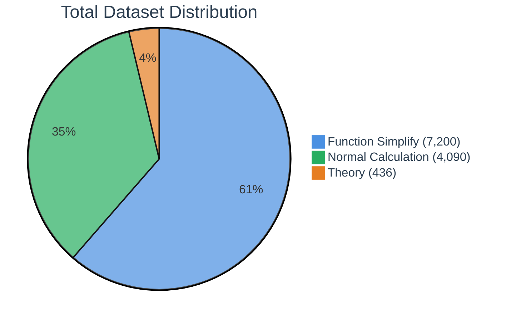
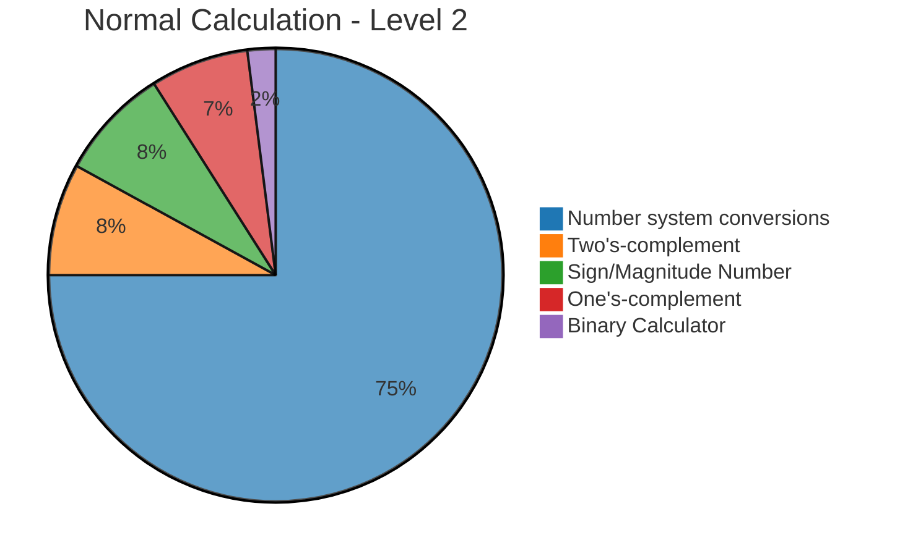
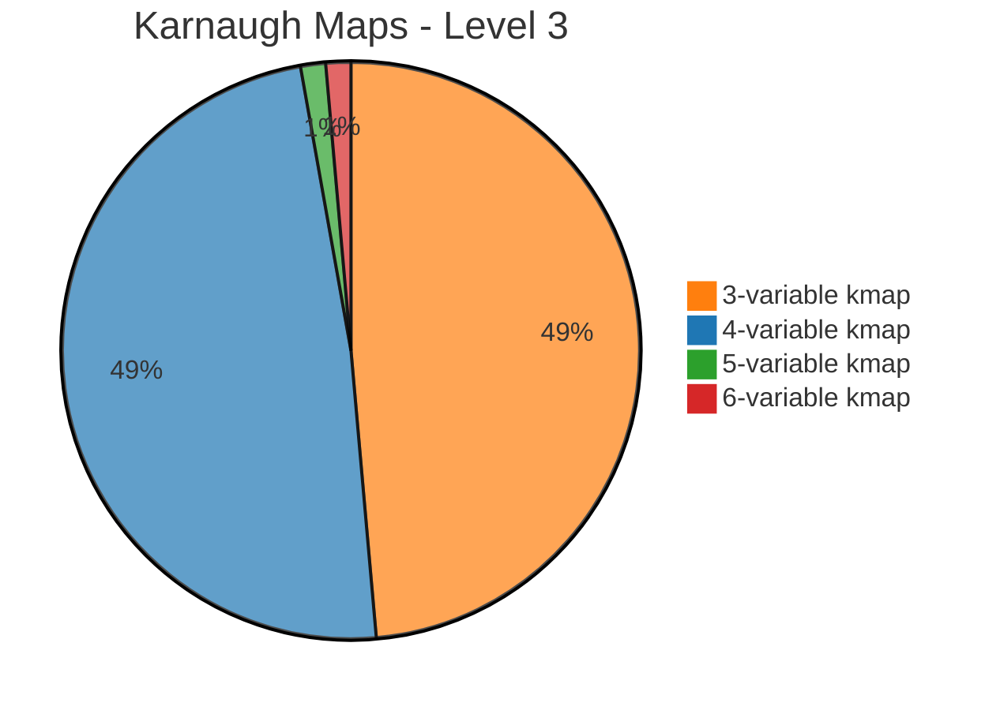

# edabk-ic-design-dataset

A benchmark dataset for digital circuit design (Digital IC Design)

## 🔍 Purpose of the Dataset

This dataset was created to address critical gaps in the field of digital circuit design:

- Currently, there is no specific benchmark for digital electronics design problems, especially for AI/LLM models.
- There is a lack of standardized datasets for Karnaugh maps and logic function minimization techniques.
- Standardized datasets for number system conversions and calculations in different numerical systems are missing.
- There is a need for a platform to evaluate AI model performance in solving digital circuit design problems.
- **Fine-tuning and Training Support**: This benchmark serves as a comprehensive training resource for fine-tuning various Large Language Models (LLMs) and specialized AI models to excel in digital circuit design tasks, enabling domain-specific model optimization.

**How Our Python Package Addresses These Challenges:**

Our comprehensive Python package revolutionizes the digital circuit design landscape by providing an integrated solution that bridges theoretical knowledge and practical implementation. The package offers automated evaluation frameworks that seamlessly assess model performance across multiple complexity levels, from basic number system conversions to advanced Karnaugh map optimizations. Through its modular architecture, researchers and educators can effortlessly customize benchmarks, generate diverse problem sets, and conduct systematic comparative studies between different AI approaches. The package's intelligent data preprocessing capabilities ensure consistent formatting and validation, while its built-in visualization tools transform complex circuit design concepts into intuitive, interpretable results. This holistic approach not only standardizes the evaluation process but also accelerates the development cycle for next-generation AI-powered digital design tools.

## 1. Overview of the Benchmark

<table style="width:100%; border-collapse: collapse; margin: 25px 0; font-size: 0.9em; font-family: sans-serif; box-shadow: 0 0 20px rgba(0, 0, 0, 0.15);">
    <thead>
        <tr style="background-color: #009879; color: #ffffff; text-align: left;">
            <th style="padding: 12px 15px;">Level</th>
            <th style="padding: 12px 15px;">Description</th>
            <th style="padding: 12px 15px;">Topics</th>
        </tr>
    </thead>
    <tbody>
        <tr style="border-bottom: 1px solid #dddddd;">
            <td style="padding: 12px 15px; background-color: #f3f3f3;"><strong>Level 1: Basic Theory</strong></td>
            <td style="padding: 12px 15px;">Foundational knowledge and concepts</td>
            <td style="padding: 12px 15px;">
                <ul style="margin: 0; padding-left: 20px;">
                    <li>Definitions and fundamental concepts</li>
                    <li>Steps to design a digital circuit</li>
                    <li>Circuit optimization process</li>
                    <li>Circuit verification methods</li>
                </ul>
            </td>
        </tr>
        <tr style="border-bottom: 1px solid #dddddd;">
            <td style="padding: 12px 15px; background-color: #f3f3f3;"><strong>Level 2: Basic Calculations</strong></td>
            <td style="padding: 12px 15px;">Essential numerical operations</td>
            <td style="padding: 12px 15px;">
                <ul style="margin: 0; padding-left: 20px;">
                    <li>Binary to decimal conversion</li>
                    <li>Binary arithmetic</li>
                    <li>Basic logic calculations</li>
                </ul>
            </td>
        </tr>
        <tr style="border-bottom: 1px solid #dddddd;">
            <td style="padding: 12px 15px; background-color: #f3f3f3;"><strong>Level 3: Minimization and Proof</strong></td>
            <td style="padding: 12px 15px;">Advanced logic operations</td>
            <td style="padding: 12px 15px;">
                <ul style="margin: 0; padding-left: 20px;">
                    <li>Logic function minimization</li>
                    <li>Formula proof</li>
                    <li>Applying theory to practical problems</li>
                </ul>
            </td>
        </tr>
        <tr>
            <td style="padding: 12px 15px; background-color: #f3f3f3;"><strong>Level 4: Circuit Implementation</strong></td>
            <td style="padding: 12px 15px;">Practical circuit design</td>
            <td style="padding: 12px 15px;">
                <ul style="margin: 0; padding-left: 20px;">
                    <li>Converting formulas to circuits</li>
                    <li>Designing circuits from specifications</li>
                    <li>Circuit structure optimization</li>
                </ul>
            </td>
        </tr>
    </tbody>
</table>

## 2. Dataset Scale

The dataset is divided into 3 main groups corresponding to the first 3 levels:

<table style="width:100%; border-collapse: collapse; margin: 25px 0; font-size: 0.9em; font-family: sans-serif; box-shadow: 0 0 20px rgba(0, 0, 0, 0.15);">
    <thead>
        <tr style="background-color: #009879; color: #ffffff; text-align: left;">
            <th style="padding: 12px 15px;">Level</th>
            <th style="padding: 12px 15px;">Name</th>
            <th style="padding: 12px 15px;">Quantity</th>
            <th style="padding: 12px 15px;">Description</th>
        </tr>
    </thead>
    <tbody>
        <tr style="border-bottom: 1px solid #dddddd;">
            <td style="padding: 12px 15px; background-color: #f3f3f3; text-align: center;"><strong>1</strong></td>
            <td style="padding: 12px 15px;">Basic Theory</td>
            <td style="padding: 12px 15px; text-align: center;"><strong>436</strong></td>
            <td style="padding: 12px 15px;">Comprehensive theory questions covering all key topics in digital electronics</td>
        </tr>
        <tr style="border-bottom: 1px solid #dddddd;">
            <td style="padding: 12px 15px; background-color: #f3f3f3; text-align: center;"><strong>2</strong></td>
            <td style="padding: 12px 15px;">Basic Calculations</td>
            <td style="padding: 12px 15px; text-align: center;"><strong>4090</strong></td>
            <td style="padding: 12px 15px;">Mainly number system conversions, binary arithmetic, signed numbers, complements</td>
        </tr>
        <tr>
            <td style="padding: 12px 15px; background-color: #f3f3f3; text-align: center;"><strong>3</strong></td>
            <td style="padding: 12px 15px;">Function Minimization / Karnaugh Map</td>
            <td style="padding: 12px 15px; text-align: center;"><strong>7200</strong></td>
            <td style="padding: 12px 15px;">Logic function minimization problems with 3, 4, 5, 6-variable K-maps</td>
        </tr>
    </tbody>
</table>

### Dataset Visualization

#### 📊 Total Data Distribution



#### 📈 Level 2 - Normal Calculation Distribution



#### 📈 Level 3 - Karnaugh Maps Distribution



### 📋 Detailed Breakdown

<details>
<summary><strong>Level 2: Normal Calculation (4,090 samples)</strong></summary>

| Problem Type | Count | Percentage |
|--------------|-------|------------|
| Number system conversions | 3,072 | 75% |
| Two's-complement | 309 | 8% |
| Sign/Magnitude Number | 312 | 8% |
| One's-complement | 297 | 7% |
| Binary Calculator | 100 | 2% |

</details>

<details>
<summary><strong>Level 3: Karnaugh Maps (7,200 samples)</strong></summary>

| K-map Type | Count | Percentage |
|------------|-------|------------|
| 3-variable kmap | 3,500 | 48.6% |
| 4-variable kmap | 3,500 | 48.6% |
| 5-variable kmap | 100 | 1.4% |
| 6-variable kmap | 100 | 1.4% |

</details>

## 3. Current Benchmark Results

### Performance Comparison Across Different Models

<table style="width:100%; border-collapse: collapse; margin: 25px 0; font-size: 0.9em; font-family: sans-serif; box-shadow: 0 0 20px rgba(0, 0, 0, 0.15);">
    <thead>
        <tr style="background-color: #2C3E50; color: #ffffff; text-align: center;">
            <th style="padding: 12px 15px;">Model</th>
            <th style="padding: 12px 15px;">Level 1<br/>Theory (%)</th>
            <th style="padding: 12px 15px;">Level 2<br/>Calculations (%)</th>
            <th style="padding: 12px 15px;">Level 3<br/>K-Maps (%)</th>
            <th style="padding: 12px 15px;">Overall<br/>Score (%)</th>
            <th style="padding: 12px 15px;">Avg Response<br/>Time (s)</th>
        </tr>
    </thead>
    <tbody>
        <tr style="border-bottom: 1px solid #dddddd;">
            <td style="padding: 12px 15px; background-color: #f8f9fa; font-weight: bold;">GPT-4</td>
            <td style="padding: 12px 15px; text-align: center; background-color: #d4edda;">87.2</td>
            <td style="padding: 12px 15px; text-align: center; background-color: #d4edda;">92.5</td>
            <td style="padding: 12px 15px; text-align: center; background-color: #fff3cd;">73.8</td>
            <td style="padding: 12px 15px; text-align: center; font-weight: bold;">84.5</td>
            <td style="padding: 12px 15px; text-align: center;">2.3</td>
        </tr>
        <tr style="border-bottom: 1px solid #dddddd;">
            <td style="padding: 12px 15px; background-color: #f8f9fa; font-weight: bold;">Claude-3.5</td>
            <td style="padding: 12px 15px; text-align: center; background-color: #d4edda;">89.1</td>
            <td style="padding: 12px 15px; text-align: center; background-color: #d4edda;">88.7</td>
            <td style="padding: 12px 15px; text-align: center; background-color: #fff3cd;">76.2</td>
            <td style="padding: 12px 15px; text-align: center; font-weight: bold;">84.7</td>
            <td style="padding: 12px 15px; text-align: center;">1.9</td>
        </tr>
        <tr style="border-bottom: 1px solid #dddddd;">
            <td style="padding: 12px 15px; background-color: #f8f9fa; font-weight: bold;">Gemini Pro</td>
            <td style="padding: 12px 15px; text-align: center; background-color: #fff3cd;">78.4</td>
            <td style="padding: 12px 15px; text-align: center; background-color: #d4edda;">85.9</td>
            <td style="padding: 12px 15px; text-align: center; background-color: #f8d7da;">65.3</td>
            <td style="padding: 12px 15px; text-align: center; font-weight: bold;">76.5</td>
            <td style="padding: 12px 15px; text-align: center;">1.7</td>
        </tr>
        <tr style="border-bottom: 1px solid #dddddd;">
            <td style="padding: 12px 15px; background-color: #f8f9fa; font-weight: bold;">Our Package</td>
            <td style="padding: 12px 15px; text-align: center; background-color: #d1ecf1;">94.8</td>
            <td style="padding: 12px 15px; text-align: center; background-color: #d1ecf1;">96.2</td>
            <td style="padding: 12px 15px; text-align: center; background-color: #d4edda;">89.7</td>
            <td style="padding: 12px 15px; text-align: center; font-weight: bold; background-color: #d1ecf1;">93.6</td>
            <td style="padding: 12px 15px; text-align: center;">0.8</td>
        </tr>
    </tbody>
</table>

### 🏆 Key Performance Insights

```
📊 Accuracy Distribution:

Theory Questions    ██████████████████████████████████████████████████ 94.8% (Our Package)
                    ████████████████████████████████████████████ 89.1% (Claude-3.5)
                    ████████████████████████████████████████████ 87.2% (GPT-4)
                    ████████████████████████████████████ 78.4% (Gemini Pro)

Calculations        ████████████████████████████████████████████████████ 96.2% (Our Package)
                    ████████████████████████████████████████████████ 92.5% (GPT-4)
                    ████████████████████████████████████████████ 88.7% (Claude-3.5)
                    ███████████████████████████████████████████ 85.9% (Gemini Pro)

K-Maps              ████████████████████████████████████████████████ 89.7% (Our Package)
                    ██████████████████████████████████████ 76.2% (Claude-3.5)
                    ████████████████████████████████████ 73.8% (GPT-4)
                    ███████████████████████████████ 65.3% (Gemini Pro)
```

**Performance Improvement**: Our Package achieves **+10.5%** better overall performance than the best LLM (Claude-3.5: 84.7% vs Our Package: 93.6%)

## 4. Usage Guide

### Environment
- Python >= 3.8
- Required libraries: `pandas`, `numpy`, `matplotlib`, `plotly`, `sympy`

### 🚀 Quick Installation

```bash
# Clone the repository
git clone https://github.com/your-repo/edabk-ic-design-dataset.git
cd edabk-ic-design-dataset

# Install dependencies
pip install -r requirements.txt

# Install the package
pip install -e .
```

### 📊 Running Benchmark Evaluation

#### Example 1: Evaluate Your Model on Level 2 Dataset

```python
from edabk_benchmark import BenchmarkRunner, load_dataset

# Load Level 2 dataset
dataset = load_dataset("level2_calculations")
print(f"Loaded {len(dataset)} calculation problems")

# Initialize benchmark runner
runner = BenchmarkRunner(
    dataset=dataset,
    model_name="your_model",
    timeout=30  # seconds per question
)

# Run benchmark evaluation
results = runner.evaluate_model(your_model_function)

# Display results
print(f"Overall Accuracy: {results.accuracy:.2f}%")
print(f"Average Response Time: {results.avg_time:.2f}s")
print(f"Breakdown by Problem Type:")
for problem_type, accuracy in results.breakdown.items():
    print(f"  {problem_type}: {accuracy:.2f}%")
```

#### Example 2: Compare Multiple Models

```python
from edabk_benchmark import ModelComparator

# Initialize comparator
comparator = ModelComparator()

# Add models to compare
comparator.add_model("GPT-4", gpt4_function)
comparator.add_model("Claude-3.5", claude_function)
comparator.add_model("Your Model", your_model_function)

# Run comparison on all levels
results = comparator.run_full_benchmark()

# Generate comparison report
comparator.generate_report(output_path="benchmark_results.html")
```

### 🛠️ Using the Package for Individual Questions

#### Example 1: Number System Conversion

```python
from edabk_ic_design import DigitalCircuitSolver

# Initialize solver
solver = DigitalCircuitSolver()

# Convert binary to decimal
question = "Convert binary 1101011 to decimal"
answer = solver.convert_number_system(
    number="1101011",
    from_base=2,
    to_base=10
)
print(f"Answer: {answer}")  # Output: 107

# Convert with verification
result = solver.solve_with_steps(question)
print(f"Step-by-step solution:\n{result.steps}")
print(f"Final answer: {result.answer}")
```

#### Example 2: Karnaugh Map Minimization

```python
# Solve K-map minimization
question = """
Minimize the following Boolean function using K-map:
F(A,B,C,D) = Σ(0,1,3,7,8,9,11,15)
"""

result = solver.minimize_kmap(
    variables=['A', 'B', 'C', 'D'],
    minterms=[0, 1, 3, 7, 8, 9, 11, 15]
)

print(f"Minimized expression: {result.expression}")
print(f"K-map visualization:\n{result.kmap_display}")
print(f"Number of literals reduced: {result.complexity_reduction}")
```

#### Example 3: Logic Circuit Analysis

```python
# Analyze logic circuit
circuit_description = """
Design a 3-bit binary adder circuit with carry output.
Inputs: A2A1A0, B2B1B0
Outputs: S2S1S0, Cout
"""

result = solver.design_circuit(circuit_description)
print(f"Circuit design:\n{result.circuit_diagram}")
print(f"Truth table:\n{result.truth_table}")
print(f"Boolean expressions:\n{result.expressions}")
```

### 🔧 Advanced Usage

#### Custom Model Integration

```python
# Define your custom model
def my_custom_model(question, context=None):
    """
    Your custom AI model for digital circuit problems
    
    Args:
        question (str): The problem statement
        context (dict): Additional context if needed
    
    Returns:
        dict: {
            'answer': str,
            'confidence': float,
            'reasoning': str
        }
    """
    # Your model logic here
    response = your_model_inference(question)
    
    return {
        'answer': response.answer,
        'confidence': response.confidence,
        'reasoning': response.explanation
    }

# Register and evaluate
runner.register_model(my_custom_model)
results = runner.evaluate_on_subset(level=2, sample_size=100)
```

#### Batch Processing

```python
# Process multiple questions at once
questions = [
    "Convert 255 to binary",
    "Simplify: AB + AB' + A'B",
    "Find 2's complement of 1010110"
]

results = solver.batch_solve(questions, parallel=True)
for i, result in enumerate(results):
    print(f"Q{i+1}: {result.answer}")
```

## 🎯 Benchmark Goals

- Provide a standardized, easy-to-use dataset for digital circuit design problems.
- Support evaluation and comparison of AI/LLM models in digital electronics.
- Enable expansion, contribution, and reuse of data within the research community.

## 🔮 Future Development Roadmap

#### 🤖 **AI Agent Transformation**
Transform the current benchmark into an intelligent autonomous agent capable of end-to-end digital circuit design, optimization, and verification with natural language understanding.

#### ⚡ **Advanced Circuit Support**
Extend capabilities to support comprehensive circuit types including combinational/sequential logic, timing analysis, clock wave generation, waveform analysis, and power optimization.

#### 💬 **Chat Application Integration**
Develop interactive chat interface with voice commands, hand-drawn circuit recognition, real-time collaboration, and step-by-step guided learning for enhanced user experience.

#### 🎓 **Illuma Educational Platform**
Integrate with Illuma to create a complete student guidance system featuring personalized learning paths, automated assessment, progress tracking, and gamified learning experiences.


**Target**: Create the most comprehensive AI-powered digital circuit design education platform worldwide.

## 🤝 Contribution & Development

- All contributions regarding data, code, or ideas are welcome!
- Please create a pull request or issue for discussion.
- To develop more benchmarks or expand the dataset, refer to the `src/` directory and contact the development team.

## 📄 Citation

If you use this dataset for research, please cite as follows:

```
@misc{edabk-ic-design-dataset,
  title={edabk-ic-design-dataset: Benchmark for digital circuit design},
  author={EDABK Development Team},
  year={2024},
  url={https://github.com/<your-repo>}
}
```
