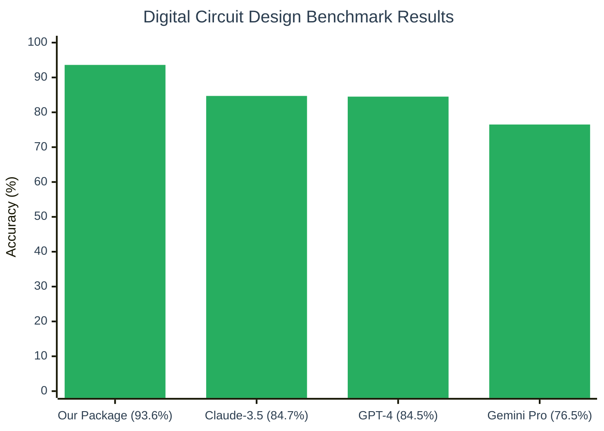

<div align="center">
  
</div>

## 🚀 Introduction

**edabk-ic-design-dataset** is a complete ecosystem for digital circuit design education and research, consisting of three main components:

- **📦 Python Package**: A ready-to-use library available via `pip install digitalcircuit` that provides instant solutions for Karnaugh map minimization (3-4 variables), number system conversions, binary arithmetic, and digital logic calculations.

- **📊 Benchmark Suite**: A standardized evaluation framework for comparing AI/LLM model performance across different complexity levels of digital circuit design problems.

- **🗃️ Dataset Collection**: Over 11,700 carefully curated problems spanning from basic theory to advanced circuit optimization, designed for both academic research and practical applications.

This integrated platform bridges the gap between theoretical knowledge and practical implementation, making digital circuit design accessible to students, researchers, and AI developers worldwide.

## 🎯 Purpose

This project addresses critical gaps in digital circuit design education and AI evaluation:

- **Standardized Benchmarking**: First comprehensive benchmark specifically designed for digital electronics problems and AI/LLM evaluation
- **Educational Resource**: Structured dataset for Karnaugh maps, logic minimization, and number system conversions  
- **AI Training Platform**: Fine-tuning resource for Large Language Models in domain-specific circuit design tasks
- **Practical Solutions**: Ready-to-use Python package that solves real-world digital design challenges instantly

Our integrated approach provides automated evaluation frameworks, customizable benchmarks, and intelligent preprocessing capabilities that accelerate both learning and research in digital circuit design.


## 1. Package

### 🔗 Installation & Access

The **digitalcircuit** Python package is available on PyPI and provides comprehensive digital circuit design capabilities:

**📦 Quick Installation:**
```bash
pip install digitalcircuit
```

**🌐 Package Repository:** [https://pypi.org/project/digitalcircuit/](https://pypi.org/project/digitalcircuit/)


## 2. Current Benchmark Results

### 🏆 Key Performance Insights



## 🎯 Benchmark Goals

- Provide a standardized, easy-to-use dataset for digital circuit design problems.
- Support evaluation and comparison of AI/LLM models in digital electronics.
- Enable expansion, contribution, and reuse of data within the research community.

## 3. Data Scale

#### 📊 Digital Circuit Design Dataset Structure

<div align="center">
  
[](https://chart-studio.plotly.com/~duonggiang156/5/)

</div>

## 4. Usage Guide

### Environment
- Python >= 3.8
- Required libraries: `pandas`, `numpy`, `matplotlib`, `plotly`, `sympy`

### 🚀 Quick Installation

```bash
# Clone the repository
git clone https://github.com/your-repo/edabk-ic-design-dataset.git
cd edabk-ic-design-dataset

# Install dependencies
pip install -r requirements.txt

# Install the package
pip install -e .
```

### 🔧 Advanced Usage

#### Custom Model Integration

```python
# Define your custom model
def my_custom_model(question, context=None):
    """
    Your custom AI model for digital circuit problems
    
    Args:
        question (str): The problem statement
        context (dict): Additional context if needed
    
    Returns:
        dict: {
            'answer': str,
            'confidence': float,
            'reasoning': str
        }
    """
    # Your model logic here
    response = your_model_inference(question)
    
    return {
        'answer': response.answer,
        'confidence': response.confidence,
        'reasoning': response.explanation
    }

# Register and evaluate
runner.register_model(my_custom_model)
results = runner.evaluate_on_subset(level=2, sample_size=100)
```

#### Batch Processing

```python
# Process multiple questions at once
questions = [
    "Convert 255 to binary",
    "Simplify: AB + AB' + A'B",
    "Find 2's complement of 1010110"
]

results = solver.batch_solve(questions, parallel=True)
for i, result in enumerate(results):
    print(f"Q{i+1}: {result.answer}")
```

## 🔮 Future Development Roadmap

### 🎯 Development Priorities

#### 🤖 **AI Agent Transformation**
Transform the current benchmark into an intelligent autonomous agent capable of end-to-end digital circuit design, optimization, and verification with natural language understanding.

#### ⚡ **Advanced Circuit Support**
Extend capabilities to support comprehensive circuit types including combinational/sequential logic, timing analysis, clock wave generation, waveform analysis, and power optimization.

#### 💬 **Chat Application Integration**
Develop interactive chat interface with voice commands, hand-drawn circuit recognition, real-time collaboration, and step-by-step guided learning for enhanced user experience.

#### 🎓 **Illuma Educational Platform**
Integrate with Illuma to create a complete student guidance system featuring personalized learning paths, automated assessment, progress tracking, and gamified learning experiences.

**Target**: Create the most comprehensive AI-powered digital circuit design education platform worldwide.

## 🤝 Contribution & Development

- All contributions regarding data, code, or ideas are welcome!
- Please create a pull request or issue for discussion.
- To develop more benchmarks or expand the dataset, refer to the `src/` directory and contact the development team.

## 📄 Citation

If you use this dataset for research, please cite as follows:

```
@misc{edabk-ic-design-dataset,
  title={edabk-ic-design-dataset: Benchmark for digital circuit design},
  author={EDABK Development Team},
  year={2024},
  url={https://github.com/<your-repo>}
}
```
