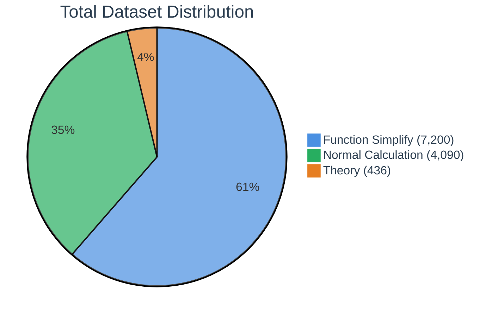
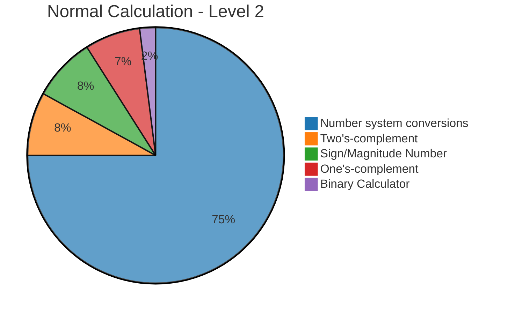
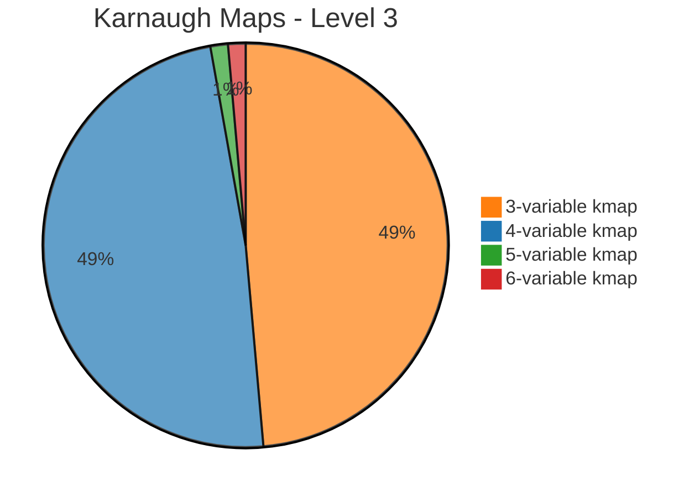

# edabk-ic-design-dataset

A benchmark dataset for digital circuit design (Digital IC Design)

## 🔍 Purpose of the Dataset

This dataset was created to address critical gaps in the field of digital circuit design:

- Currently, there is no specific benchmark for digital electronics design problems, especially for AI/LLM models.
- There is a lack of standardized datasets for Karnaugh maps and logic function minimization techniques.
- Standardized datasets for number system conversions and calculations in different numerical systems are missing.
- There is a need for a platform to evaluate AI model performance in solving digital circuit design problems.
- **Fine-tuning and Training Support**: This benchmark serves as a comprehensive training resource for fine-tuning various Large Language Models (LLMs) and specialized AI models to excel in digital circuit design tasks, enabling domain-specific model optimization.

**How Our Python Package Addresses These Challenges:**

Our comprehensive Python package revolutionizes the digital circuit design landscape by providing an integrated solution that bridges theoretical knowledge and practical implementation. The package offers automated evaluation frameworks that seamlessly assess model performance across multiple complexity levels, from basic number system conversions to advanced Karnaugh map optimizations. Through its modular architecture, researchers and educators can effortlessly customize benchmarks, generate diverse problem sets, and conduct systematic comparative studies between different AI approaches. The package's intelligent data preprocessing capabilities ensure consistent formatting and validation, while its built-in visualization tools transform complex circuit design concepts into intuitive, interpretable results. This holistic approach not only standardizes the evaluation process but also accelerates the development cycle for next-generation AI-powered digital design tools.

## 1. Overview of the Benchmark

<table style="width:100%; border-collapse: collapse; margin: 25px 0; font-size: 0.9em; font-family: sans-serif; box-shadow: 0 0 20px rgba(0, 0, 0, 0.15);">
    <thead>
        <tr style="background-color: #009879; color: #ffffff; text-align: left;">
            <th style="padding: 12px 15px;">Level</th>
            <th style="padding: 12px 15px;">Description</th>
            <th style="padding: 12px 15px;">Topics</th>
        </tr>
    </thead>
    <tbody>
        <tr style="border-bottom: 1px solid #dddddd;">
            <td style="padding: 12px 15px; background-color: #f3f3f3;"><strong>Level 1: Basic Theory</strong></td>
            <td style="padding: 12px 15px;">Foundational knowledge and concepts</td>
            <td style="padding: 12px 15px;">
                <ul style="margin: 0; padding-left: 20px;">
                    <li>Definitions and fundamental concepts</li>
                    <li>Steps to design a digital circuit</li>
                    <li>Circuit optimization process</li>
                    <li>Circuit verification methods</li>
                </ul>
            </td>
        </tr>
        <tr style="border-bottom: 1px solid #dddddd;">
            <td style="padding: 12px 15px; background-color: #f3f3f3;"><strong>Level 2: Basic Calculations</strong></td>
            <td style="padding: 12px 15px;">Essential numerical operations</td>
            <td style="padding: 12px 15px;">
                <ul style="margin: 0; padding-left: 20px;">
                    <li>Binary to decimal conversion</li>
                    <li>Binary arithmetic</li>
                    <li>Basic logic calculations</li>
                </ul>
            </td>
        </tr>
        <tr style="border-bottom: 1px solid #dddddd;">
            <td style="padding: 12px 15px; background-color: #f3f3f3;"><strong>Level 3: Minimization and Proof</strong></td>
            <td style="padding: 12px 15px;">Advanced logic operations</td>
            <td style="padding: 12px 15px;">
                <ul style="margin: 0; padding-left: 20px;">
                    <li>Logic function minimization</li>
                    <li>Formula proof</li>
                    <li>Applying theory to practical problems</li>
                </ul>
            </td>
        </tr>
        <tr>
            <td style="padding: 12px 15px; background-color: #f3f3f3;"><strong>Level 4: Circuit Implementation</strong></td>
            <td style="padding: 12px 15px;">Practical circuit design</td>
            <td style="padding: 12px 15px;">
                <ul style="margin: 0; padding-left: 20px;">
                    <li>Converting formulas to circuits</li>
                    <li>Designing circuits from specifications</li>
                    <li>Circuit structure optimization</li>
                </ul>
            </td>
        </tr>
    </tbody>
</table>

## 2. Dataset Scale

The dataset is divided into 3 main groups corresponding to the first 3 levels:

<table style="width:100%; border-collapse: collapse; margin: 25px 0; font-size: 0.9em; font-family: sans-serif; box-shadow: 0 0 20px rgba(0, 0, 0, 0.15);">
    <thead>
        <tr style="background-color: #009879; color: #ffffff; text-align: left;">
            <th style="padding: 12px 15px;">Level</th>
            <th style="padding: 12px 15px;">Name</th>
            <th style="padding: 12px 15px;">Quantity</th>
            <th style="padding: 12px 15px;">Description</th>
        </tr>
    </thead>
    <tbody>
        <tr style="border-bottom: 1px solid #dddddd;">
            <td style="padding: 12px 15px; background-color: #f3f3f3; text-align: center;"><strong>1</strong></td>
            <td style="padding: 12px 15px;">Basic Theory</td>
            <td style="padding: 12px 15px; text-align: center;"><strong>436</strong></td>
            <td style="padding: 12px 15px;">Comprehensive theory questions covering all key topics in digital electronics</td>
        </tr>
        <tr style="border-bottom: 1px solid #dddddd;">
            <td style="padding: 12px 15px; background-color: #f3f3f3; text-align: center;"><strong>2</strong></td>
            <td style="padding: 12px 15px;">Basic Calculations</td>
            <td style="padding: 12px 15px; text-align: center;"><strong>4090</strong></td>
            <td style="padding: 12px 15px;">Mainly number system conversions, binary arithmetic, signed numbers, complements</td>
        </tr>
        <tr>
            <td style="padding: 12px 15px; background-color: #f3f3f3; text-align: center;"><strong>3</strong></td>
            <td style="padding: 12px 15px;">Function Minimization / Karnaugh Map</td>
            <td style="padding: 12px 15px; text-align: center;"><strong>7200</strong></td>
            <td style="padding: 12px 15px;">Logic function minimization problems with 3, 4, 5, 6-variable K-maps</td>
        </tr>
    </tbody>
</table>

### Dataset Visualization

#### 📊 Total Data Distribution



#### 📈 Level 2 - Normal Calculation Distribution



#### 📈 Level 3 - Karnaugh Maps Distribution



### 📋 Detailed Breakdown

<details>
<summary><strong>Level 2: Normal Calculation (4,090 samples)</strong></summary>

| Problem Type | Count | Percentage |
|--------------|-------|------------|
| Number system conversions | 3,072 | 75% |
| Two's-complement | 309 | 8% |
| Sign/Magnitude Number | 312 | 8% |
| One's-complement | 297 | 7% |
| Binary Calculator | 100 | 2% |

</details>

<details>
<summary><strong>Level 3: Karnaugh Maps (7,200 samples)</strong></summary>

| K-map Type | Count | Percentage |
|------------|-------|------------|
| 3-variable kmap | 3,500 | 48.6% |
| 4-variable kmap | 3,500 | 48.6% |
| 5-variable kmap | 100 | 1.4% |
| 6-variable kmap | 100 | 1.4% |

</details>

## 3. Usage Guide

### Environment
- Python >= 3.x
- Required libraries: `pandas`, `numpy`, `matplotlib`, `plotly`

### Benchmark usage workflow

```
Step 1: Clone repository
    |
Step 2: Install dependencies
    |
Step 3: Run benchmark with the corresponding dataset
    |
Step 4: Evaluate results using metrics
```

### Detailed steps

1. **Clone repository**
   ```bash
   git clone <link-repo>
   cd <repo-folder-name>
   ```

2. **Install dependencies**
   ```bash
   pip install -r requirements.txt
   ```

3. **Run benchmark**
   - Follow the instructions in the `src/` directory or use the provided notebook/scripts.

4. **Evaluate results**
   - Use the following metrics:
     - Accuracy
     - Processing time
     - Solution complexity

## 🎯 Benchmark Goals

- Provide a standardized, easy-to-use dataset for digital circuit design problems.
- Support evaluation and comparison of AI/LLM models in digital electronics.
- Enable expansion, contribution, and reuse of data within the research community.

## 🚀 Quick Start

1. Clone repository:
   ```bash
   git clone <link-repo>
   cd <repo-folder-name>
   ```
2. Install dependencies:
   ```bash
   pip install -r requirements.txt
   ```
3. Run a sample script:
   ```bash
   python src/run_benchmark.py --dataset 1cau_convert_so.xlsx
   ```

## 🤝 Contribution & Development

- All contributions regarding data, code, or ideas are welcome!
- Please create a pull request or issue for discussion.
- To develop more benchmarks or expand the dataset, refer to the `src/` directory and contact the development team.

## 📄 Citation

If you use this dataset for research, please cite as follows:

```
@misc{edabk-ic-design-dataset,
  title={edabk-ic-design-dataset: Benchmark for digital circuit design},
  author={EDABK Development Team},
  year={2024},
  url={https://github.com/<your-repo>}
}
```
