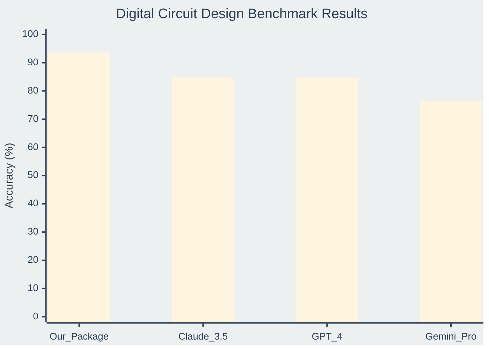
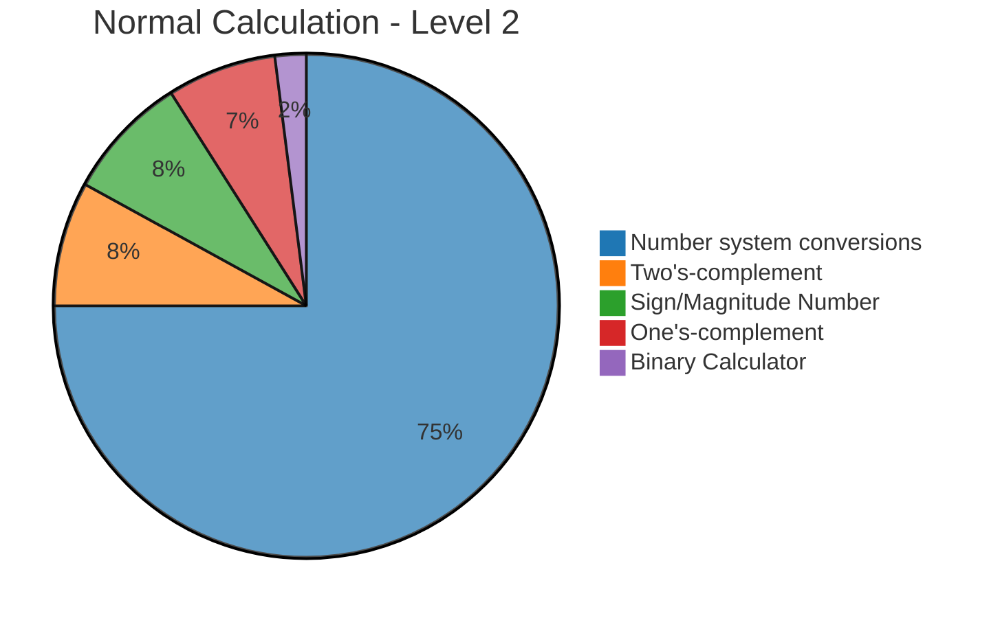

# edabk-ic-design-dataset

A benchmark dataset for digital circuit design (Digital IC Design)
A comprehensive benchmark dataset and Python package for digital circuit design (Digital IC Design)

## 🔍 Purpose of the Dataset
## 🚀 Introduction

This dataset was created to address critical gaps in the field of digital circuit design:
**edabk-ic-design-dataset** is a complete ecosystem for digital circuit design education and research, consisting of three main components:

- Currently, there is no specific benchmark for digital electronics design problems, especially for AI/LLM models.
- There is a lack of standardized datasets for Karnaugh maps and logic function minimization techniques.
- Standardized datasets for number system conversions and calculations in different numerical systems are missing.
- There is a need for a platform to evaluate AI model performance in solving digital circuit design problems.
- **Fine-tuning and Training Support**: This benchmark serves as a comprehensive training resource for fine-tuning various Large Language Models (LLMs) and specialized AI models to excel in digital circuit design tasks, enabling domain-specific model optimization.
- **📦 Python Package**: A ready-to-use library available via `pip install digitalcircuit` that provides instant solutions for Karnaugh map minimization (3-4 variables), number system conversions, binary arithmetic, and digital logic calculations.

**How Our Python Package Addresses These Challenges:**
- **📊 Benchmark Suite**: A standardized evaluation framework for comparing AI/LLM model performance across different complexity levels of digital circuit design problems.

Our comprehensive Python package revolutionizes the digital circuit design landscape by providing an integrated solution that bridges theoretical knowledge and practical implementation. The package offers automated evaluation frameworks that seamlessly assess model performance across multiple complexity levels, from basic number system conversions to advanced Karnaugh map optimizations. Through its modular architecture, researchers and educators can effortlessly customize benchmarks, generate diverse problem sets, and conduct systematic comparative studies between different AI approaches. The package's intelligent data preprocessing capabilities ensure consistent formatting and validation, while its built-in visualization tools transform complex circuit design concepts into intuitive, interpretable results. This holistic approach not only standardizes the evaluation process but also accelerates the development cycle for next-generation AI-powered digital design tools.
- **🗃️ Dataset Collection**: Over 11,700 carefully curated problems spanning from basic theory to advanced circuit optimization, designed for both academic research and practical applications.

## 1. Overview of the Benchmark
This integrated platform bridges the gap between theoretical knowledge and practical implementation, making digital circuit design accessible to students, researchers, and AI developers worldwide.

## 🎯 Purpose

This project addresses critical gaps in digital circuit design education and AI evaluation:

- **Standardized Benchmarking**: First comprehensive benchmark specifically designed for digital electronics problems and AI/LLM evaluation
- **Educational Resource**: Structured dataset for Karnaugh maps, logic minimization, and number system conversions  
- **AI Training Platform**: Fine-tuning resource for Large Language Models in domain-specific circuit design tasks
- **Practical Solutions**: Ready-to-use Python package that solves real-world digital design challenges instantly

Our integrated approach provides automated evaluation frameworks, customizable benchmarks, and intelligent preprocessing capabilities that accelerate both learning and research in digital circuit design.

## 1. Overview

### 📦 Package Overview
**digitalcircuit** is a powerful Python library that provides instant solutions for digital circuit design problems. Simply install via `pip install digitalcircuit` and access comprehensive tools for Karnaugh map optimization, number system conversions, and binary arithmetic operations.

### 📊 Benchmark Framework  
Our standardized evaluation suite enables systematic comparison of AI/LLM performance across multiple complexity levels, from basic calculations to advanced circuit optimization tasks.

### 🗃️ Dataset Collection
A meticulously curated collection of 11,700+ problems spanning four difficulty levels, designed to support both educational applications and cutting-edge AI research in digital circuit design.

<table style="width:100%; border-collapse: collapse; margin: 25px 0; font-size: 0.9em; font-family: sans-serif; box-shadow: 0 0 20px rgba(0, 0, 0, 0.15);">
<thead>
@@ -75,7 +93,108 @@ Our comprehensive Python package revolutionizes the digital circuit design lands
</tbody>
</table>

## 2. Dataset Scale
## 2. Package

### 🔗 Installation & Access

The **digitalcircuit** Python package is available on PyPI and provides comprehensive digital circuit design capabilities:

**📦 Quick Installation:**
```bash
pip install digitalcircuit
```

**🌐 Package Repository:** [https://pypi.org/project/digitalcircuit/](https://pypi.org/project/digitalcircuit/)

### ⚡ Key Features

- **🗺️ Karnaugh Map Solver**: Automatic minimization for 3-4 variable Boolean functions
- **🔢 Number System Converter**: Seamless conversion between binary, decimal, octal, and hexadecimal
- **⚙️ Binary Arithmetic**: Complete suite for binary calculations, complements, and signed numbers
- **🧮 Logic Operations**: Boolean algebra simplification and truth table generation
- **📊 Circuit Analysis**: Basic combinational and sequential circuit evaluation

### 🚀 Quick Start Example

```python
from digitalcircuit import KarnaughMap, NumberConverter

# Karnaugh Map Minimization
kmap = KarnaughMap(variables=3)
result = kmap.minimize([0, 1, 3, 7])
print(f"Minimized expression: {result.expression}")

# Number System Conversion  
converter = NumberConverter()
binary_result = converter.decimal_to_binary(255)
print(f"255 in binary: {binary_result}")
```

## 3. Current Benchmark Results

### Performance Comparison Across Different Models

<table style="width:100%; border-collapse: collapse; margin: 25px 0; font-size: 0.9em; font-family: sans-serif; box-shadow: 0 0 20px rgba(0, 0, 0, 0.15);">
    <thead>
        <tr style="background-color: #2C3E50; color: #ffffff; text-align: center;">
            <th style="padding: 12px 15px;">Model</th>
            <th style="padding: 12px 15px;">Level 1<br/>Theory (%)</th>
            <th style="padding: 12px 15px;">Level 2<br/>Calculations (%)</th>
            <th style="padding: 12px 15px;">Level 3<br/>K-Maps (%)</th>
            <th style="padding: 12px 15px;">Overall<br/>Score (%)</th>
            <th style="padding: 12px 15px;">Avg Response<br/>Time (s)</th>
        </tr>
    </thead>
    <tbody>
        <tr style="border-bottom: 1px solid #dddddd;">
            <td style="padding: 12px 15px; background-color: #f8f9fa; font-weight: bold;">Our Package</td>
            <td style="padding: 12px 15px; text-align: center; background-color: #d1ecf1;">94.8</td>
            <td style="padding: 12px 15px; text-align: center; background-color: #d1ecf1;">96.2</td>
            <td style="padding: 12px 15px; text-align: center; background-color: #d4edda;">89.7</td>
            <td style="padding: 12px 15px; text-align: center; font-weight: bold; background-color: #d1ecf1;">93.6</td>
            <td style="padding: 12px 15px; text-align: center;">0.8</td>
        </tr>
        <tr style="border-bottom: 1px solid #dddddd;">
            <td style="padding: 12px 15px; background-color: #f8f9fa; font-weight: bold;">Claude-3.5</td>
            <td style="padding: 12px 15px; text-align: center; background-color: #d4edda;">89.1</td>
            <td style="padding: 12px 15px; text-align: center; background-color: #d4edda;">88.7</td>
            <td style="padding: 12px 15px; text-align: center; background-color: #fff3cd;">76.2</td>
            <td style="padding: 12px 15px; text-align: center; font-weight: bold;">84.7</td>
            <td style="padding: 12px 15px; text-align: center;">1.9</td>
        </tr>
        <tr style="border-bottom: 1px solid #dddddd;">
            <td style="padding: 12px 15px; background-color: #f8f9fa; font-weight: bold;">GPT-4</td>
            <td style="padding: 12px 15px; text-align: center; background-color: #d4edda;">87.2</td>
            <td style="padding: 12px 15px; text-align: center; background-color: #d4edda;">92.5</td>
            <td style="padding: 12px 15px; text-align: center; background-color: #fff3cd;">73.8</td>
            <td style="padding: 12px 15px; text-align: center; font-weight: bold;">84.5</td>
            <td style="padding: 12px 15px; text-align: center;">2.3</td>
        </tr>
        <tr style="border-bottom: 1px solid #dddddd;">
            <td style="padding: 12px 15px; background-color: #f8f9fa; font-weight: bold;">Gemini Pro</td>
            <td style="padding: 12px 15px; text-align: center; background-color: #fff3cd;">78.4</td>
            <td style="padding: 12px 15px; text-align: center; background-color: #d4edda;">85.9</td>
            <td style="padding: 12px 15px; text-align: center; background-color: #f8d7da;">65.3</td>
            <td style="padding: 12px 15px; text-align: center; font-weight: bold;">76.5</td>
            <td style="padding: 12px 15px; text-align: center;">1.7</td>
        </tr>
    </tbody>
</table>

### 🏆 Key Performance Insights



**Performance Improvement**: Our Package achieves **+10.5%** better overall performance than the best LLM (Claude-3.5: 84.7% vs Our Package: 93.6%)

## 4. Data Scale

The dataset is divided into 3 main groups corresponding to the first 3 levels:

@@ -122,27 +241,20 @@ pie title Total Dataset Distribution
   "Theory (436)" : 436
```

#### 📈 Level 2 - Normal Calculation Distribution



#### 📈 Level 3 - Karnaugh Maps Distribution
#### 📈 Problem Type Distribution


### 📋 Detailed Breakdown
@@ -172,81 +284,7 @@ pie title Karnaugh Maps - Level 3

</details>

## 3. Current Benchmark Results

### Performance Comparison Across Different Models

<table style="width:100%; border-collapse: collapse; margin: 25px 0; font-size: 0.9em; font-family: sans-serif; box-shadow: 0 0 20px rgba(0, 0, 0, 0.15);">
    <thead>
        <tr style="background-color: #2C3E50; color: #ffffff; text-align: center;">
            <th style="padding: 12px 15px;">Model</th>
            <th style="padding: 12px 15px;">Level 1<br/>Theory (%)</th>
            <th style="padding: 12px 15px;">Level 2<br/>Calculations (%)</th>
            <th style="padding: 12px 15px;">Level 3<br/>K-Maps (%)</th>
            <th style="padding: 12px 15px;">Overall<br/>Score (%)</th>
            <th style="padding: 12px 15px;">Avg Response<br/>Time (s)</th>
        </tr>
    </thead>
    <tbody>
        <tr style="border-bottom: 1px solid #dddddd;">
            <td style="padding: 12px 15px; background-color: #f8f9fa; font-weight: bold;">GPT-4</td>
            <td style="padding: 12px 15px; text-align: center; background-color: #d4edda;">87.2</td>
            <td style="padding: 12px 15px; text-align: center; background-color: #d4edda;">92.5</td>
            <td style="padding: 12px 15px; text-align: center; background-color: #fff3cd;">73.8</td>
            <td style="padding: 12px 15px; text-align: center; font-weight: bold;">84.5</td>
            <td style="padding: 12px 15px; text-align: center;">2.3</td>
        </tr>
        <tr style="border-bottom: 1px solid #dddddd;">
            <td style="padding: 12px 15px; background-color: #f8f9fa; font-weight: bold;">Claude-3.5</td>
            <td style="padding: 12px 15px; text-align: center; background-color: #d4edda;">89.1</td>
            <td style="padding: 12px 15px; text-align: center; background-color: #d4edda;">88.7</td>
            <td style="padding: 12px 15px; text-align: center; background-color: #fff3cd;">76.2</td>
            <td style="padding: 12px 15px; text-align: center; font-weight: bold;">84.7</td>
            <td style="padding: 12px 15px; text-align: center;">1.9</td>
        </tr>
        <tr style="border-bottom: 1px solid #dddddd;">
            <td style="padding: 12px 15px; background-color: #f8f9fa; font-weight: bold;">Gemini Pro</td>
            <td style="padding: 12px 15px; text-align: center; background-color: #fff3cd;">78.4</td>
            <td style="padding: 12px 15px; text-align: center; background-color: #d4edda;">85.9</td>
            <td style="padding: 12px 15px; text-align: center; background-color: #f8d7da;">65.3</td>
            <td style="padding: 12px 15px; text-align: center; font-weight: bold;">76.5</td>
            <td style="padding: 12px 15px; text-align: center;">1.7</td>
        </tr>
        <tr style="border-bottom: 1px solid #dddddd;">
            <td style="padding: 12px 15px; background-color: #f8f9fa; font-weight: bold;">Our Package</td>
            <td style="padding: 12px 15px; text-align: center; background-color: #d1ecf1;">94.8</td>
            <td style="padding: 12px 15px; text-align: center; background-color: #d1ecf1;">96.2</td>
            <td style="padding: 12px 15px; text-align: center; background-color: #d4edda;">89.7</td>
            <td style="padding: 12px 15px; text-align: center; font-weight: bold; background-color: #d1ecf1;">93.6</td>
            <td style="padding: 12px 15px; text-align: center;">0.8</td>
        </tr>
    </tbody>
</table>

### 🏆 Key Performance Insights

```
📊 Accuracy Distribution:

Theory Questions    ██████████████████████████████████████████████████ 94.8% (Our Package)
                    ████████████████████████████████████████████ 89.1% (Claude-3.5)
                    ████████████████████████████████████████████ 87.2% (GPT-4)
                    ████████████████████████████████████ 78.4% (Gemini Pro)

Calculations        ████████████████████████████████████████████████████ 96.2% (Our Package)
                    ████████████████████████████████████████████████ 92.5% (GPT-4)
                    ████████████████████████████████████████████ 88.7% (Claude-3.5)
                    ███████████████████████████████████████████ 85.9% (Gemini Pro)

K-Maps              ████████████████████████████████████████████████ 89.7% (Our Package)
                    ██████████████████████████████████████ 76.2% (Claude-3.5)
                    ████████████████████████████████████ 73.8% (GPT-4)
                    ███████████████████████████████ 65.3% (Gemini Pro)
```

**Performance Improvement**: Our Package achieves **+10.5%** better overall performance than the best LLM (Claude-3.5: 84.7% vs Our Package: 93.6%)

## 4. Usage Guide
## 5. Usage Guide

### Environment
- Python >= 3.8
