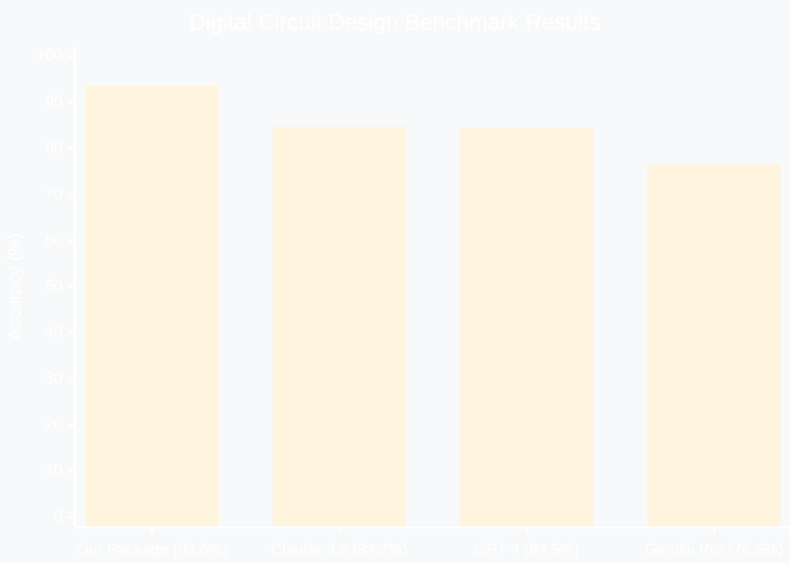
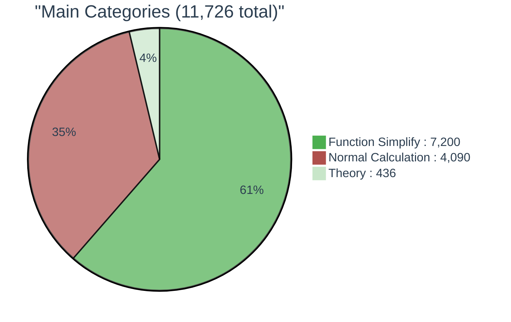
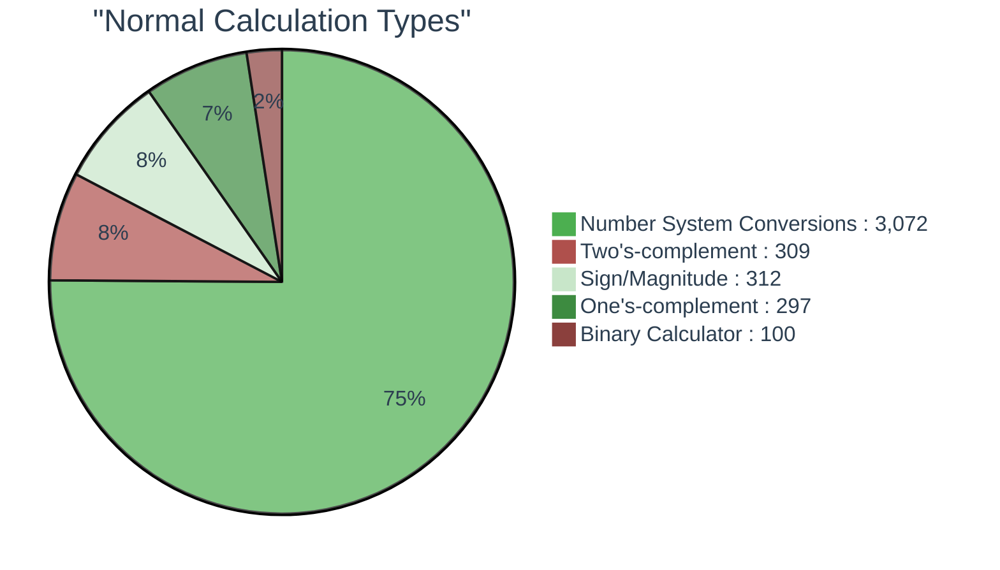
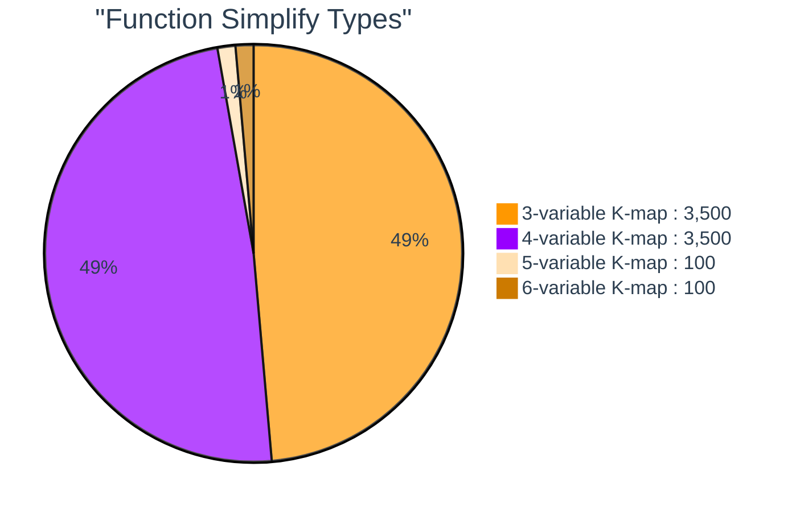

## 🎓 edabk-ic-design-dataset

<div align="center">
  
</div>

## 🚀 Introduction

**edabk-ic-design-dataset** is a complete ecosystem for digital circuit design education and research, consisting of three main components:

- **📦 Python Package**: A ready-to-use library available via `pip install digitalcircuit` that provides instant solutions for Karnaugh map minimization (3-4 variables), number system conversions, binary arithmetic, and digital logic calculations.

- **📊 Benchmark Suite**: A standardized evaluation framework for comparing AI/LLM model performance across different complexity levels of digital circuit design problems.

- **🗃️ Dataset Collection**: Over 11,700 carefully curated problems spanning from basic theory to advanced circuit optimization, designed for both academic research and practical applications.

This integrated platform bridges the gap between theoretical knowledge and practical implementation, making digital circuit design accessible to students, researchers, and AI developers worldwide.

## 🎯 Purpose

This project addresses critical gaps in digital circuit design education and AI evaluation:

- **Standardized Benchmarking**: First comprehensive benchmark specifically designed for digital electronics problems and AI/LLM evaluation
- **Educational Resource**: Structured dataset for Karnaugh maps, logic minimization, and number system conversions  
- **AI Training Platform**: Fine-tuning resource for Large Language Models in domain-specific circuit design tasks
- **Practical Solutions**: Ready-to-use Python package that solves real-world digital design challenges instantly

Our integrated approach provides automated evaluation frameworks, customizable benchmarks, and intelligent preprocessing capabilities that accelerate both learning and research in digital circuit design.

## 1. Overview

### 📦 Package Overview
**digitalcircuit** is a powerful Python library that provides instant solutions for digital circuit design problems. Simply install via `pip install digitalcircuit` and access comprehensive tools for Karnaugh map optimization, number system conversions, and binary arithmetic operations.

### 📊 Benchmark Framework  
Our standardized evaluation suite enables systematic comparison of AI/LLM performance across multiple complexity levels, from basic calculations to advanced circuit optimization tasks.

### 🗃️ Dataset Collection
A meticulously curated collection of 11,700+ problems spanning four difficulty levels, designed to support both educational applications and cutting-edge AI research in digital circuit design.

<div align="center">
<table style="width:100%; border-collapse: collapse; margin: 25px 0; font-size: 0.9em; font-family: sans-serif; box-shadow: 0 0 20px rgba(0, 0, 0, 0.15);">
    <thead>
        <tr style="background-color: #009879; color: #ffffff; text-align: left;">
            <th style="padding: 12px 15px;">Level</th>
            <th style="padding: 12px 15px;">Description</th>
            <th style="padding: 12px 15px;">Topics</th>
        </tr>
    </thead>
    <tbody>
        <tr style="border-bottom: 1px solid #dddddd;">
            <td style="padding: 12px 15px; background-color: #f3f3f3;"><strong>Level 1: Basic Theory</strong></td>
            <td style="padding: 12px 15px;">Foundational knowledge and concepts</td>
            <td style="padding: 12px 15px;">
                <ul style="margin: 0; padding-left: 20px;">
                    <li>Definitions and fundamental concepts</li>
                    <li>Steps to design a digital circuit</li>
                    <li>Circuit optimization process</li>
                    <li>Circuit verification methods</li>
                </ul>
            </td>
        </tr>
        <tr style="border-bottom: 1px solid #dddddd;">
            <td style="padding: 12px 15px; background-color: #f3f3f3;"><strong>Level 2: Basic Calculations</strong></td>
            <td style="padding: 12px 15px;">Essential numerical operations</td>
            <td style="padding: 12px 15px;">
                <ul style="margin: 0; padding-left: 20px;">
                    <li>Binary to decimal conversion</li>
                    <li>Binary arithmetic</li>
                    <li>Basic logic calculations</li>
                </ul>
            </td>
        </tr>
        <tr style="border-bottom: 1px solid #dddddd;">
            <td style="padding: 12px 15px; background-color: #f3f3f3;"><strong>Level 3: Minimization and Proof</strong></td>
            <td style="padding: 12px 15px;">Advanced logic operations</td>
            <td style="padding: 12px 15px;">
                <ul style="margin: 0; padding-left: 20px;">
                    <li>Logic function minimization</li>
                    <li>Formula proof</li>
                    <li>Applying theory to practical problems</li>
                </ul>
            </td>
        </tr>
        <tr>
            <td style="padding: 12px 15px; background-color: #f3f3f3;"><strong>Level 4: Circuit Implementation</strong></td>
            <td style="padding: 12px 15px;">Practical circuit design</td>
            <td style="padding: 12px 15px;">
                <ul style="margin: 0; padding-left: 20px;">
                    <li>Converting formulas to circuits</li>
                    <li>Designing circuits from specifications</li>
                    <li>Circuit structure optimization</li>
                </ul>
            </td>
        </tr>
    </tbody>
</table>
</div>

## 2. Package

### 🔗 Installation & Access

The **digitalcircuit** Python package is available on PyPI and provides comprehensive digital circuit design capabilities:

**📦 Quick Installation:**
```bash
pip install digitalcircuit
```

**🌐 Package Repository:** [https://pypi.org/project/digitalcircuit/](https://pypi.org/project/digitalcircuit/)

### ⚡ Key Features

- **🗺️ Karnaugh Map Solver**: Automatic minimization for 3-4 variable Boolean functions
- **🔢 Number System Converter**: Seamless conversion between binary, decimal, octal, and hexadecimal
- **⚙️ Binary Arithmetic**: Complete suite for binary calculations, complements, and signed numbers
- **🧮 Logic Operations**: Boolean algebra simplification and truth table generation
- **📊 Circuit Analysis**: Basic combinational and sequential circuit evaluation

### 🚀 Quick Start Example

```python
from digitalcircuit import KarnaughMap, NumberConverter

# Karnaugh Map Minimization
kmap = KarnaughMap(variables=3)
result = kmap.minimize([0, 1, 3, 7])
print(f"Minimized expression: {result.expression}")

# Number System Conversion  
converter = NumberConverter()
binary_result = converter.decimal_to_binary(255)
print(f"255 in binary: {binary_result}")
```

## 3. Current Benchmark Results

### ⚡ Performance Comparison Across Different Models

<div align="center">
<table style="width:100%; border-collapse: collapse; margin: 25px 0; font-size: 0.9em; font-family: sans-serif; box-shadow: 0 0 20px rgba(0, 0, 0, 0.15);">
    <thead>
        <tr style="background-color: #2C3E50; color: #ffffff; text-align: center;">
            <th style="padding: 12px 15px;">Model</th>
            <th style="padding: 12px 15px;">Level 1<br/>Theory (%)</th>
            <th style="padding: 12px 15px;">Level 2<br/>Calculations (%)</th>
            <th style="padding: 12px 15px;">Level 3<br/>K-Maps (%)</th>
            <th style="padding: 12px 15px;">Overall<br/>Score (%)</th>
            <th style="padding: 12px 15px;">Avg Response<br/>Time (s)</th>
        </tr>
    </thead>
    <tbody>
        <tr style="border-bottom: 1px solid #dddddd;">
            <td style="padding: 12px 15px; background-color: #f8f9fa; font-weight: bold;">Our Package</td>
            <td style="padding: 12px 15px; text-align: center; background-color: #d1ecf1;">94.8</td>
            <td style="padding: 12px 15px; text-align: center; background-color: #d1ecf1;">96.2</td>
            <td style="padding: 12px 15px; text-align: center; background-color: #d4edda;">89.7</td>
            <td style="padding: 12px 15px; text-align: center; font-weight: bold; background-color: #d1ecf1;">93.6</td>
            <td style="padding: 12px 15px; text-align: center;">0.8</td>
        </tr>
        <tr style="border-bottom: 1px solid #dddddd;">
            <td style="padding: 12px 15px; background-color: #f8f9fa; font-weight: bold;">Claude-3.5</td>
            <td style="padding: 12px 15px; text-align: center; background-color: #d4edda;">89.1</td>
            <td style="padding: 12px 15px; text-align: center; background-color: #d4edda;">88.7</td>
            <td style="padding: 12px 15px; text-align: center; background-color: #fff3cd;">76.2</td>
            <td style="padding: 12px 15px; text-align: center; font-weight: bold;">84.7</td>
            <td style="padding: 12px 15px; text-align: center;">1.9</td>
        </tr>
        <tr style="border-bottom: 1px solid #dddddd;">
            <td style="padding: 12px 15px; background-color: #f8f9fa; font-weight: bold;">GPT-4</td>
            <td style="padding: 12px 15px; text-align: center; background-color: #d4edda;">87.2</td>
            <td style="padding: 12px 15px; text-align: center; background-color: #d4edda;">92.5</td>
            <td style="padding: 12px 15px; text-align: center; background-color: #fff3cd;">73.8</td>
            <td style="padding: 12px 15px; text-align: center; font-weight: bold;">84.5</td>
            <td style="padding: 12px 15px; text-align: center;">2.3</td>
        </tr>
        <tr style="border-bottom: 1px solid #dddddd;">
            <td style="padding: 12px 15px; background-color: #f8f9fa; font-weight: bold;">Gemini Pro</td>
            <td style="padding: 12px 15px; text-align: center; background-color: #fff3cd;">78.4</td>
            <td style="padding: 12px 15px; text-align: center; background-color: #d4edda;">85.9</td>
            <td style="padding: 12px 15px; text-align: center; background-color: #f8d7da;">65.3</td>
            <td style="padding: 12px 15px; text-align: center; font-weight: bold;">76.5</td>
            <td style="padding: 12px 15px; text-align: center;">1.7</td>
        </tr>
    </tbody>
</table>
</div>

### 🏆 Key Performance Insights



**Performance Analysis:**
- 🥇 **Our Package leads** with 93.6% accuracy
- 📈 **+10.5% improvement** over best LLM (Claude-3.5)
- ⚡ **Fastest response time** at 0.8 seconds
- 🎯 **Consistent performance** across all problem categories


## 🎯 Benchmark Goals

- Provide a standardized, easy-to-use dataset for digital circuit design problems.
- Support evaluation and comparison of AI/LLM models in digital electronics.
- Enable expansion, contribution, and reuse of data within the research community.

## 4. Data Scale

#### 📊 Digital Circuit Design Dataset Structure

<div align="center">

### 🌟 **Sunburst Chart - 3 Concentric Rings**


**🎯 Multi-Layer Visualization:**



**Normal Calculation Breakdown (4,090 samples):**



**Function Simplify Breakdown (7,200 samples):**



**🎯 3-Layer Structure:**

<div style="display: flex; justify-content: center; align-items: center; margin: 20px 0;">
  <div style="text-align: center; margin: 0 30px;">
    <div style="width: 80px; height: 80px; border-radius: 50%; background: #2C3E50; display: flex; align-items: center; justify-content: center; color: white; font-weight: bold; margin: 0 auto 10px;">CENTER</div>
    <small>Benchmark<br>(11,726)</small>
  </div>
  <div style="text-align: center; margin: 0 30px;">
    <div style="width: 120px; height: 120px; border-radius: 50%; background: linear-gradient(120deg, #E3F2FD 33%, #4CAF50 33%, #4CAF50 66%, #FF9800 66%); display: flex; align-items: center; justify-content: center; color: white; font-weight: bold; margin: 0 auto 10px;">RING 1</div>
    <small>3 Categories</small>
  </div>
  <div style="text-align: center; margin: 0 30px;">
    <div style="width: 160px; height: 160px; border-radius: 50%; background: conic-gradient(#E3F2FD 30deg, #4CAF50 30deg, #4CAF50 120deg, #2196F3 120deg, #FF9800 180deg, #9C27B0 240deg, #E91E63 270deg, #F44336 300deg, #FF5722 330deg, #795548 350deg, #607D8B 360deg); display: flex; align-items: center; justify-content: center; color: white; font-weight: bold; margin: 0 auto 10px;">RING 2</div>
    <small>10 Problem Types</small>
  </div>
</div>

**📊 Category Breakdown:**
- 🔵 **Theory** (436): Theory Problems
- 🟢 **Normal Calculation** (4,090): Number System Conversions (3,072), Two's-complement (309), Sign/Magnitude (312), One's-complement (297), Binary Calculator (100)  
- 🟠 **Function Simplify** (7,200): 3-variable K-map (3,500), 4-variable K-map (3,500), 5-variable K-map (100), 6-variable K-map (100)

</div>

**Dataset Hierarchy:**
- **🎯 Center**: Benchmark Dataset (11,726 total samples)
- **🔵 Level 1**: 3 main categories - Theory (436), Normal Calculation (4,090), Function Simplify (7,200)  
- **🔷 Level 2**: 10 specific problem types with detailed sample counts

## 5. Usage Guide

### Environment
- Python >= 3.8
- Required libraries: `pandas`, `numpy`, `matplotlib`, `plotly`, `sympy`

### 🚀 Quick Installation

```bash
# Clone the repository
git clone https://github.com/your-repo/edabk-ic-design-dataset.git
cd edabk-ic-design-dataset

# Install dependencies
pip install -r requirements.txt

# Install the package
pip install -e .
```

### 📊 Running Benchmark Evaluation

#### Example 1: Evaluate Your Model on Level 2 Dataset

```python
from edabk_benchmark import BenchmarkRunner, load_dataset

# Load Level 2 dataset
dataset = load_dataset("level2_calculations")
print(f"Loaded {len(dataset)} calculation problems")

# Initialize benchmark runner
runner = BenchmarkRunner(
    dataset=dataset,
    model_name="your_model",
    timeout=30  # seconds per question
)

# Run benchmark evaluation
results = runner.evaluate_model(your_model_function)

# Display results
print(f"Overall Accuracy: {results.accuracy:.2f}%")
print(f"Average Response Time: {results.avg_time:.2f}s")
print(f"Breakdown by Problem Type:")
for problem_type, accuracy in results.breakdown.items():
    print(f"  {problem_type}: {accuracy:.2f}%")
```

#### Example 2: Compare Multiple Models

```python
from edabk_benchmark import ModelComparator

# Initialize comparator
comparator = ModelComparator()

# Add models to compare
comparator.add_model("GPT-4", gpt4_function)
comparator.add_model("Claude-3.5", claude_function)
comparator.add_model("Your Model", your_model_function)

# Run comparison on all levels
results = comparator.run_full_benchmark()

# Generate comparison report
comparator.generate_report(output_path="benchmark_results.html")
```

### 🛠️ Using the Package for Individual Questions

#### Example 1: Number System Conversion

```python
from edabk_ic_design import DigitalCircuitSolver

# Initialize solver
solver = DigitalCircuitSolver()

# Convert binary to decimal
question = "Convert binary 1101011 to decimal"
answer = solver.convert_number_system(
    number="1101011",
    from_base=2,
    to_base=10
)
print(f"Answer: {answer}")  # Output: 107

# Convert with verification
result = solver.solve_with_steps(question)
print(f"Step-by-step solution:\n{result.steps}")
print(f"Final answer: {result.answer}")
```

#### Example 2: Karnaugh Map Minimization

```python
# Solve K-map minimization
question = """
Minimize the following Boolean function using K-map:
F(A,B,C,D) = Σ(0,1,3,7,8,9,11,15)
"""

result = solver.minimize_kmap(
    variables=['A', 'B', 'C', 'D'],
    minterms=[0, 1, 3, 7, 8, 9, 11, 15]
)

print(f"Minimized expression: {result.expression}")
print(f"K-map visualization:\n{result.kmap_display}")
print(f"Number of literals reduced: {result.complexity_reduction}")
```

#### Example 3: Logic Circuit Analysis

```python
# Analyze logic circuit
circuit_description = """
Design a 3-bit binary adder circuit with carry output.
Inputs: A2A1A0, B2B1B0
Outputs: S2S1S0, Cout
"""

result = solver.design_circuit(circuit_description)
print(f"Circuit design:\n{result.circuit_diagram}")
print(f"Truth table:\n{result.truth_table}")
print(f"Boolean expressions:\n{result.expressions}")
```

### 🔧 Advanced Usage

#### Custom Model Integration

```python
# Define your custom model
def my_custom_model(question, context=None):
    """
    Your custom AI model for digital circuit problems
    
    Args:
        question (str): The problem statement
        context (dict): Additional context if needed
    
    Returns:
        dict: {
            'answer': str,
            'confidence': float,
            'reasoning': str
        }
    """
    # Your model logic here
    response = your_model_inference(question)
    
    return {
        'answer': response.answer,
        'confidence': response.confidence,
        'reasoning': response.explanation
    }

# Register and evaluate
runner.register_model(my_custom_model)
results = runner.evaluate_on_subset(level=2, sample_size=100)
```

#### Batch Processing

```python
# Process multiple questions at once
questions = [
    "Convert 255 to binary",
    "Simplify: AB + AB' + A'B",
    "Find 2's complement of 1010110"
]

results = solver.batch_solve(questions, parallel=True)
for i, result in enumerate(results):
    print(f"Q{i+1}: {result.answer}")
```

## 🔮 Future Development Roadmap

### 🎯 Development Priorities

#### 🤖 **AI Agent Transformation**
Transform the current benchmark into an intelligent autonomous agent capable of end-to-end digital circuit design, optimization, and verification with natural language understanding.

#### ⚡ **Advanced Circuit Support**
Extend capabilities to support comprehensive circuit types including combinational/sequential logic, timing analysis, clock wave generation, waveform analysis, and power optimization.

#### 💬 **Chat Application Integration**
Develop interactive chat interface with voice commands, hand-drawn circuit recognition, real-time collaboration, and step-by-step guided learning for enhanced user experience.

#### 🎓 **Illuma Educational Platform**
Integrate with Illuma to create a complete student guidance system featuring personalized learning paths, automated assessment, progress tracking, and gamified learning experiences.

**Target**: Create the most comprehensive AI-powered digital circuit design education platform worldwide.

## 🤝 Contribution & Development

- All contributions regarding data, code, or ideas are welcome!
- Please create a pull request or issue for discussion.
- To develop more benchmarks or expand the dataset, refer to the `src/` directory and contact the development team.

## 📄 Citation

If you use this dataset for research, please cite as follows:

```
@misc{edabk-ic-design-dataset,
  title={edabk-ic-design-dataset: Benchmark for digital circuit design},
  author={EDABK Development Team},
  year={2024},
  url={https://github.com/<your-repo>}
}
```
